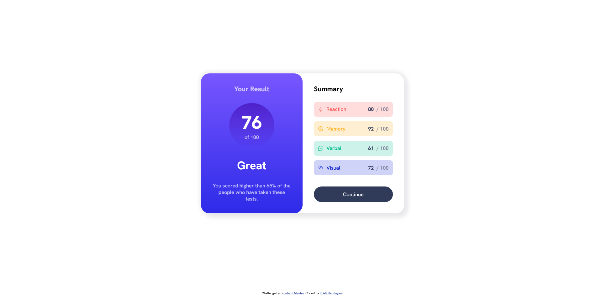

# Frontend Mentor-Results Summary Component
This is my solution to the [Results summary component challenge on Frontend Mentor](https://www.frontendmentor.io/challenges/results-summary-component-CE_K6s0maV)

## Screenshot

## Link
[Live Site URL](https://kristihan.github.io/FrontendMentor-ResultsSummaryComponent/)

## Built with
- Semantic HTML5 markup
- CSS custom properties
- Flexbox
- CSS Grid
- Google Fonts
- Javascript

## Useful resources
- [How to Read a JSON File in JavaScript from freeCodeCamp](https://www.freecodecamp.org/news/how-to-read-json-file-in-javascript/)
- [How to create HTML list from JavaScript array from GeeksforGeeks](https://www.geeksforgeeks.org/how-to-creating-html-list-from-javascript-array/)